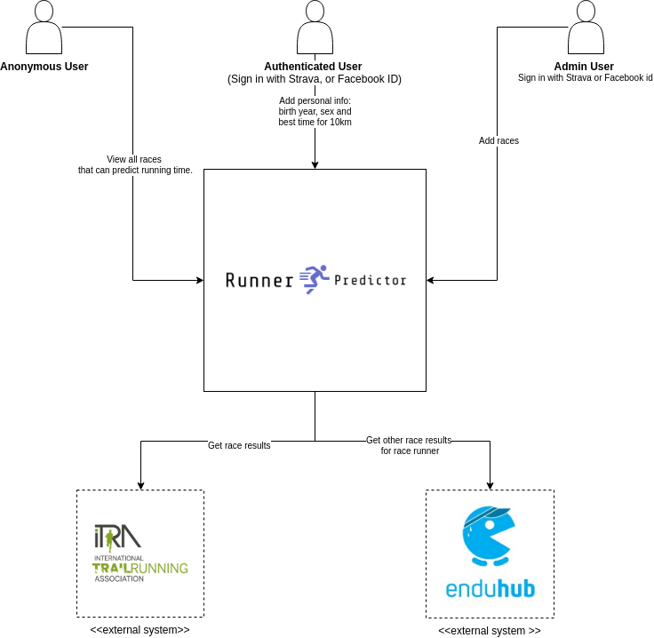

# Runner Predictor
The Runner Predictor app provides a way to predict time results of mountain races.
The runner provides basic information about himself, such as sex, age, and time of 10 kilometers and  choose the race and the app gives the approximate time of completion.

## Users

The Runner Predictor has three types of user:

1. **Anonymous** - anybody with a web browser, can only view races for prediction
2. **Authenticated** - a runner who wants to predict the time of his future run
3. **Admin** - people with administrative (super-user) access to the website can manage the races

## External Systems

1. **Itra page** - scraping event results, runner name, birth, time
2. **Enduhub** - scraping other event results for example best 10 km time.

